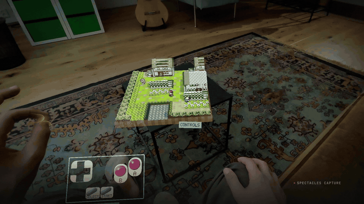
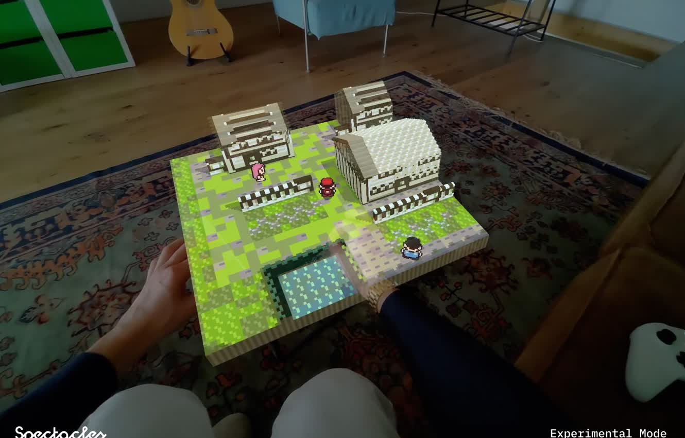
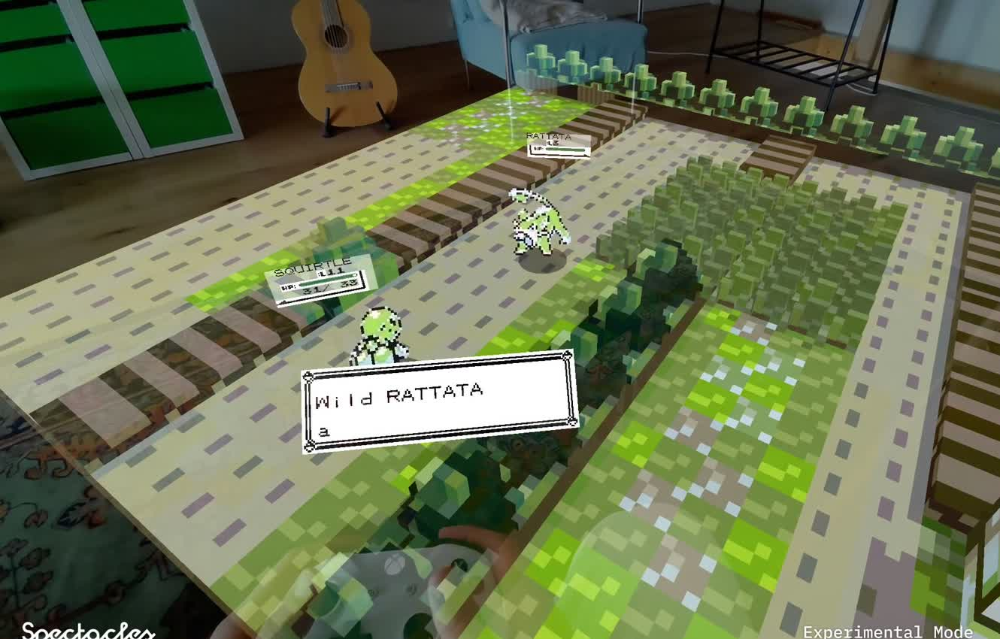

# Pocket Diorama

A Snap Spectacles lens that turns the Game Boy world on a cartridge **you own** into a
voxel diorama on your table, and lets you play it there: every map, every NPC, every
battle and every menu, read from the cartridge at runtime and drawn as voxels.

[](docs/media/pocket-diorama-reel.mp4)

*Thirty seconds of the lens: [watch the reel](docs/media/pocket-diorama-reel.mp4) (mp4, 30 s).*



Version 1.0.0, built for the Spectacles Community Challenge of September 2026. One
repository, one code: the published lens and the developer build are the same project
with two flags in different positions.

## This repository ships no game content

No maps, no sprites, no text, no music, no ROM. What it carries is an extractor and a
symbol manifest: addresses and identifiers, not bytes. Everything you see is read out of
a cartridge dump **you** provide, decoded on your own hardware, and cached on your own
glasses. Nothing is redistributed.

You bring your own legally obtained cartridge, and you are responsible for its legality.
Nothing derived from a ROM ever enters git: `.gitignore` blocks `*.gb`, `*.gbc`, `*.sav`
and `Assets/Generated/`, and the CI job fails the build the first time one is tracked.

That posture is not a workaround. It is the entire reason this can be open source.

## How a world gets in

**The player's way.** Go to [pocket-diorama.vercel.app](https://pocket-diorama.vercel.app)
and drop a dump of your Pokemon Red, Blue or Yellow (USA, Europe) cartridge on the page. The page runs
the lens's own extractor in your browser, bakes the world, files the result privately for
a day and shows a six-letter code. Type the code in the lens. The world is fetched over
https once and then lives on the glasses. The cartridge never leaves your machine; the
site only ever sees the baked world. The site is in [`web/`](web/README.md).

**The developer's way.** [`bridge/`](bridge/README.md) is a small Node tool on your LAN
that hands the cartridge bytes to the lens over WebSocket; the lens verifies the hash and
extracts on the glasses. It needs Experimental APIs, so it is a development path and the
flag for it (`Use Lan Bridge`) is off in the published build.

**Without either**, a first-time user sees a four-step guide on a Game Boy, above an
empty voxel plate that already answers the hands. That is what a Lens Explorer reviewer
sees.

## What it does

- **Extraction.** Everything the game needs comes out of the cartridge byte-identical to
  the reference extractor: maps, tilesets, text, sprites, species, moves, encounters, the
  type chart, trainers, items, palettes, the font, the battle animations, the sound
  programs. On this laptop the whole bake takes half a second.
- **The world.** Any of the 222 maps as a voxel diorama, indoors and out, one batched
  mesh per map, on a slab with visible earth. Colour and shape come from what a tile *is*.
  Curvature, tilt, render distance and the day tint are yours to set from the menu.
- **The game.** The original collision, warps and map seams; NPCs where the ROM puts
  them, looking where it says; trainers who see you; the map scripts, ported one by one,
  running on a small script VM; shops, the PC, the slot machines, the Safari Zone,
  fishing, the bike, surfing, hidden items, the bookshelves; the whole route from the
  bedroom to the Hall of Fame and the credits.
- **Battles.** Damage, critical hits, status, stat stages, turn order, capture, experience,
  evolution, learnsets, obedience and the trainer AI, checked against the cartridge's own
  tables. A wild encounter grows the world about your tile until the grass is shoulder
  height and the fight is life-size in your room.
- **Sound.** Cries and music are synthesised from the cartridge's sound programs by a
  four-channel chip written for the lens.
- **Hands and phone.** Pinch a cell and Red walks there behind a green frame; pinch a
  person and he walks up and talks; hold a pinch and your hand is the joystick. Pinch the
  plate's edge to move the diorama, pull with two hands to scale it from tabletop to
  standing inside it, pinch off the world for A. For everything a pinch cannot say, the
  Game Boy's own A, B, D-pad, SELECT and START hang loose below the line of sight; they
  step aside when a phone (through the Spectacles App) or a Bluetooth pad is connected.
- **The first run is a Game Boy.** With no world yet, a Game Boy rises into view and its
  own buttons page through four steps: what this is, where the code comes from, the code
  itself, and where the plate landed.
- **Persistence.** The baked world and the save live in the lens's storage. After the
  first code the computer is not needed again. NEW WORLD on the main menu forgets the
  stored world, and only the world, so another cartridge or a fresh bake can take its place.



What is still missing is short and listed under *Known gaps* below.

## How it works

```
cartridge  ─► rom/ extractor ─► bundle (1.7 MB JSON) ─► world/ voxel renderer
   in the browser (web/) or on the glasses (bridge/)        │
                                                            ▼
      audio/ chip  ◄─  play/ overworld, script VM, battles, screens  ─► GbCanvas
```

Interfaces carry the whole thing, and each layer is deliberately unable to tell which
implementation it has:

```typescript
interface WorldSource  { connect(callbacks): void }  // https site | LAN bridge | cache
interface InputSource  { dpad; a; b; start; select }  // hands | plate | phone | BLE pad | scripted
interface WorldTransfer { tick(dt): void; close(): void }
```

The scene is built in code. Geometry is CPU `MeshBuilder`, materials are preset clones
with every property set explicitly, and there are no graph shaders anywhere, because the
lens has to compile under two Lens Studio versions: **5.23.1** for development, with the
agent tooling and LEAF, and **5.15.4**, which is what Spectacles (2024) runs. `tools/make515.sh` generates the 5.15 sibling project from this
one and compiles it against its own Spectacles Interaction Kit.

The published build is `make515.sh publish`: Bluetooth pad off, LAN bridge off,
Experimental APIs off, cache on. `make515.sh testbuild` is the same with the save ladder
on, ten entry points from Pewter Gym to the Indigo Plateau for spot checks on the glasses.

## Getting it running

**[docs/GETTING-STARTED.md](docs/GETTING-STARTED.md)** takes you from clone to a world on
your own glasses, with your own cartridge, including what to do when each step goes wrong.

You need Lens Studio 5.23 or newer, Node 24, Git LFS, and a dump of **Pokemon Red, Blue
or Yellow (USA, Europe)** that you own: SHA-1 `ea9bcae617fdf159b045185467ae58b2e4a48b9a`
for Red, `d7037c83e1ae5b39bde3c30787637ba1d4c48ce2` for Blue,
`cc7d03262ebfaf2f06772c1a480c7d9d5f4a38e1` for Yellow. Red and Blue share an engine;
Yellow has its own opening, title, rival and Jessie and James, ported on 19 September
2026 (its companion Pikachu does not walk behind you yet). A manifest's addresses pointed
at any other revision do not fail loudly, they produce plausible garbage, so the extractor
refuses a dump no manifest describes.

```sh
git lfs install && git clone https://github.com/JoshuaLevi/pocket-diorama.git
cd pocket-diorama
node --experimental-strip-types --import ./test/register.mjs \
     tools/bake.mjs "/path/to/your.gb" Assets/Generated/kanto.json
# open Pokemon-AR.esproj in Lens Studio, drop kanto.json on Baked World, press play
```

The project directory and `Pokemon-AR.esproj` carry the working name; the lens is called
Pocket Diorama.

## Verifying

```sh
./tools/verify.sh
```

Every gate the project has, in one command. On a machine with both Lens Studio versions
and a cartridge it ends in `VERIFY: ALL GATES PASS`, 6,330 checks and 1,287 comparisons
against the cartridge in an emulator as of 30 September 2026;
each gate that cannot run says so rather than passing quietly.

| Gate | Asserts |
|---|---|
| `tools/gate.sh` | The lens compiles with Lens Studio 5.23's compiler |
| `tools/gate515.sh` | It also compiles with 5.15.4's, the device target |
| `tools/make515.sh gate` | The generated 5.15 project compiles against its own packages |
| `test/*.test.mjs` (136 files) | The extractor, the world, the script VM, the battles, the screens, the site: Node runs the shipping TypeScript unmodified |
| `Assets/Scripts/leaf/` | Ten LEAF scenarios drive the lens in the Lens Studio preview: boot, walking, standing in a place, trainers, pinch-to-walk, Oak's lab, the cast, the edge, the play area, the Game Boy pose |
| `tools/golden.sh` | The lens's world matches a reference extraction byte for byte, when a reference is present |

Both compile gates take `--selftest`, which plants a fault and requires the gate to
report `FAIL`. The GitHub workflow runs what a hosted runner can: ROM hygiene, the sources
loading under Node, the extractor typecheck. It cannot run Lens Studio and never has a
cartridge, and it says so.

## Layout

```
Assets/Scripts/
  PokemonAR.ts           the one component in the scene; everything else is code
  Version.ts             the name and version shown and logged on launch
  rom/                   the in-lens extractor: cartridge bytes in, 18 datasets out
  world/                 bundle, voxel mesh, tile shapes, collision, world sources
  play/                  overworld, input routing, hands, items, PC, shops, saves
    script/              the script VM and the ported map scripts
    battle/              damage, status, capture, AI, evolution
    screen/              the Game Boy canvas, menus, wizard, credits, keyboard
    debug/               the save ladder for the test build
  audio/                 the four-channel chip, cries, jukebox
  leaf/                  the LEAF scenarios
  vendor/GameController/ Snap's BLE pad sample, patched, for the developer build
Assets/Manifests/        the symbol manifests (addresses, no bytes) from gen1recomp
bridge/                  the LAN pairing tool, the developer's way in
web/                     the world site: browser extraction, two routes, the code
tools/                   the gates, the baker, the 5.15 generator, the reference extractor
test/                    Node tests over the shipping TypeScript
docs/                    how it was built, what was decided, and why
```

`docs/` is where the reasoning lives: [`GETTING-STARTED.md`](docs/GETTING-STARTED.md),
[`CONTROLLERS.md`](docs/CONTROLLERS.md), [`MENUS.md`](docs/MENUS.md),
[`TRAINERS-AND-GATES.md`](docs/TRAINERS-AND-GATES.md), [`MODELS.md`](docs/MODELS.md) and the
render notes. The code, its comments and the commit history are in English.

## Known gaps

As of 30 September 2026:

- The slot reels turn without the cartridge's four blurred tiles; their address in the
  ROM could not be verified, so it was not guessed.
- Yellow: the companion Pikachu does not walk behind you and the surfing minigame is not
  there. Everything else in Kanto plays on all three cartridges.
- Saves cannot yet leave the glasses as a `.sav`.
- Indoors one tile is one thing per zone, so where the cartridge draws a table top and a
  cabinet top with the same tile (the labs, the facilities, Celadon's mansion) the tall
  one wears a strip of the other's colour.
- The hands (pinch-to-walk, the held pinch, the rim) were proven in the Lens Studio
  preview before they were tried on the glasses.

## Licence and content

MIT, see [LICENSE](LICENSE). Third-party code and data are listed in
[NOTICE.md](NOTICE.md).

`Assets/Manifests/rom_manifest_*.json` come from
[gen1recomp](https://github.com/bryanthaboi/gen1recomp) under its MIT licence and
contain no ROM bytes: symbol addresses, ordering and the identifiers the assembly throws
away, and nothing else. gen1recomp is also the reason this project can exist at all: it
established that a Generation 1 world can be rebuilt from a cartridge the player already
owns, without redistributing a byte of it.

Nothing in this repository contains Nintendo content. Pocket Diorama is not affiliated
with, endorsed by or sponsored by Nintendo, Game Freak or The Pokemon Company.

## Contributing

[CONTRIBUTING.md](CONTRIBUTING.md): the gates, the Lens Studio TypeScript restrictions,
the 5.15 portability rule, and the one absolute rule about ROMs.

## Credits

The Game Boy that hosts the first run is "Gameboy" by hirairmak
(https://sketchfab.com/hirairmak), licensed CC-BY-4.0, cut into its buttons by
`tools/gameboy-split.py`. Everything else you see in the lens comes from your
own cartridge. See `docs/MODELS.md`.
